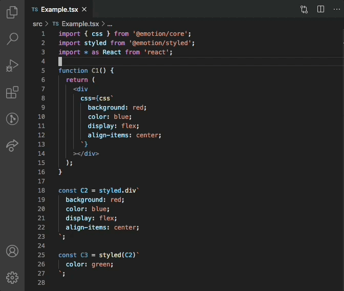

# VSCode CSS-in-JS Fold

This is a VSCode extension that adds commands to fold and unfold all CSS-in-JS blocks. This can be useful when working with libraries like [styled-components](https://styled-components.com/) and [Emotion](https://emotion.sh/).



## Installation

Get the extension on the Marketplace.

https://marketplace.visualstudio.com/items?itemName=paulshen.css-in-js-fold

If you find the commands useful, I recommend adding keybinds. Here are the ones I use.

```json
{
  "command": "css-in-js-fold.foldAll",
  "key": "cmd+k cmd+a",
  "when": "editorTextFocus"
},
{
  "command": "css-in-js-fold.unfoldAll",
  "key": "cmd+k cmd+z",
  "when": "editorTextFocus"
}
```

## Notes

The implementation uses a naive regex to find CSS-in-JS blocks.

## Release Notes

### 1.0.0

Initial release of extension
